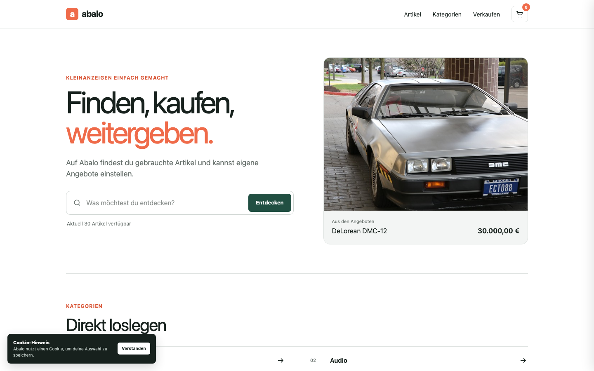

# Abalo

Abalo is a compact second-hand marketplace built as a university web-development project. Users can explore a catalog, search and filter real database records, publish new offers, and manage a shopping cart.

The project is intentionally small enough to understand quickly while still showing a complete Laravel and Vue workflow—from migrations and API endpoints to interactive browser behavior.



## Main features

### Browse and discover

- Responsive article grid using the included product catalog and images
- Live Vue search with API results while typing
- Server-side search for shareable filtered URLs
- Category filtering through real many-to-many database relationships

### Publish articles

- Clean article form with client and server validation
- Category selection loaded from the database
- Clear loading, validation, and success states
- New articles are immediately available in the catalog

### Shopping cart

- Add products directly from the catalog or live-search results
- Remove products through a slide-out cart
- Cart data is stored in the database
- The active cart ID is remembered locally in the browser

## Technology

| Layer | Technology | Purpose |
| --- | --- | --- |
| Backend | Laravel 13, PHP 8.3+ | Routes, controllers, validation, APIs, and database access |
| Frontend | Vue 3, JavaScript | Live search, article creation, and interactive cart behavior |
| Views | Blade | Server-rendered pages and catalog content |
| Styling | Tailwind CSS 4 and custom CSS | Responsive layout and shared visual system |
| Tooling | Vite 8 | Local frontend development and production builds |
| Database | SQLite by default | Simple zero-configuration local development |
| Testing | PHPUnit | Unit and feature-level regression tests |

Laravel can also use PostgreSQL by changing the database values in `.env`.

## Quick start

### Requirements

- PHP 8.3 or newer
- Composer
- Node.js and npm

### Installation

```bash
git clone https://github.com/mehdiamar4/abalo.git
cd abalo
composer run setup
composer run dev
```

Open [http://127.0.0.1:8000](http://127.0.0.1:8000).

`composer run setup` performs the complete first-time setup:

1. Installs PHP dependencies.
2. Creates `.env` and generates the application key.
3. Creates the local SQLite database.
4. Runs all migrations.
5. Imports the included demo catalog and category relationships.
6. Installs frontend dependencies and creates a production build.

The development command starts Laravel, Vite, the queue listener, and the application log viewer together.

## Demo data

The repository includes a small CSV dataset so the application is useful immediately after installation:

- 30 marketplace articles with matching product images
- 21 categories and subcategories
- 30 article-category relationships
- 7 demo users used as article owners

The importer is idempotent, so running the seeder again updates the demo records without duplicating them.

```bash
php artisan db:seed
```

To rebuild the database completely:

```bash
php artisan migrate:fresh --seed
```

## Application flow

```text
Browser
  ├─ Blade catalog and forms
  ├─ Vue live search and article form
  └─ Cart interactions
         │
         ▼
Laravel web and API routes
         │
         ▼
Controllers and query builder
         │
         ▼
SQLite / PostgreSQL
```

Important routes:

| Method | Route | Description |
| --- | --- | --- |
| `GET` | `/` | Marketplace homepage and catalog |
| `GET` | `/?category={id}` | Catalog filtered by category |
| `GET` | `/newarticle` | Create-article page |
| `GET` | `/api/articles?search={term}` | Live article search |
| `POST` | `/api/articles` | Create an article |
| `POST` | `/api/shoppingcart` | Add an article to the cart |
| `GET` | `/api/shoppingcart/{id}` | Read the current cart |
| `DELETE` | `/api/shoppingcart/{cart}/articles/{article}` | Remove a cart item |

## Development commands

```bash
# Run all tests
composer test

# Start only the Laravel server
php artisan serve

# Start only the Vite development server
npm run dev

# Build optimized frontend assets
npm run build

# Show registered routes
php artisan route:list
```

## Testing

The feature tests cover the homepage, database-backed category filtering, and the article creation page. Run them with:

```bash
composer test
```

## Project structure

```text
app/Http/Controllers/   Request handling and marketplace logic
database/data/          Source CSV catalog
database/migrations/    Database schema
database/seeders/       Repeatable demo-data importer
public/images/          Product images
resources/css/          Shared responsive styling
resources/js/           Vue components and browser interactions
resources/views/        Blade pages
routes/                 Web and JSON API routes
tests/                  PHPUnit unit and feature tests
```

## Project goals

Abalo focuses on practical full-stack fundamentals: clear routes, relational data, small JSON APIs, progressive frontend enhancement, and an interface that remains understandable without a large framework abstraction. It is designed as a learning project, but it runs as a complete local marketplace rather than a collection of isolated exercises.
